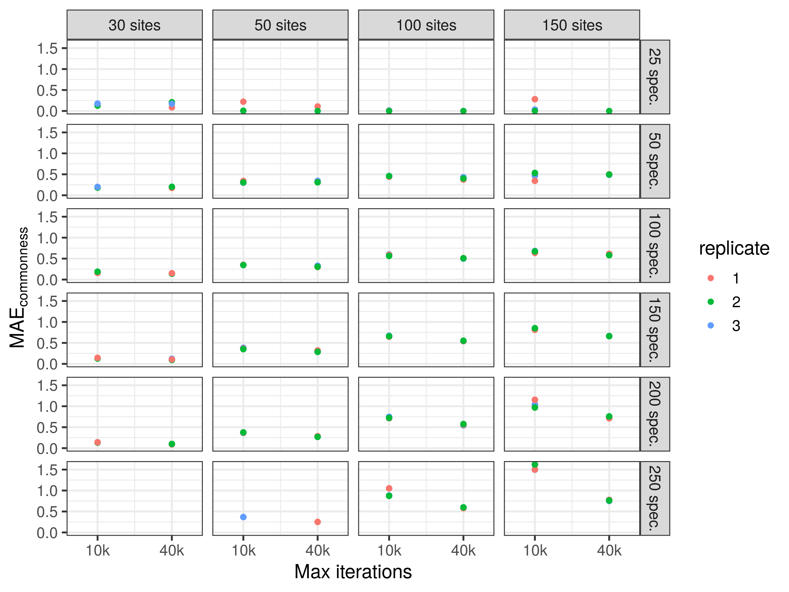
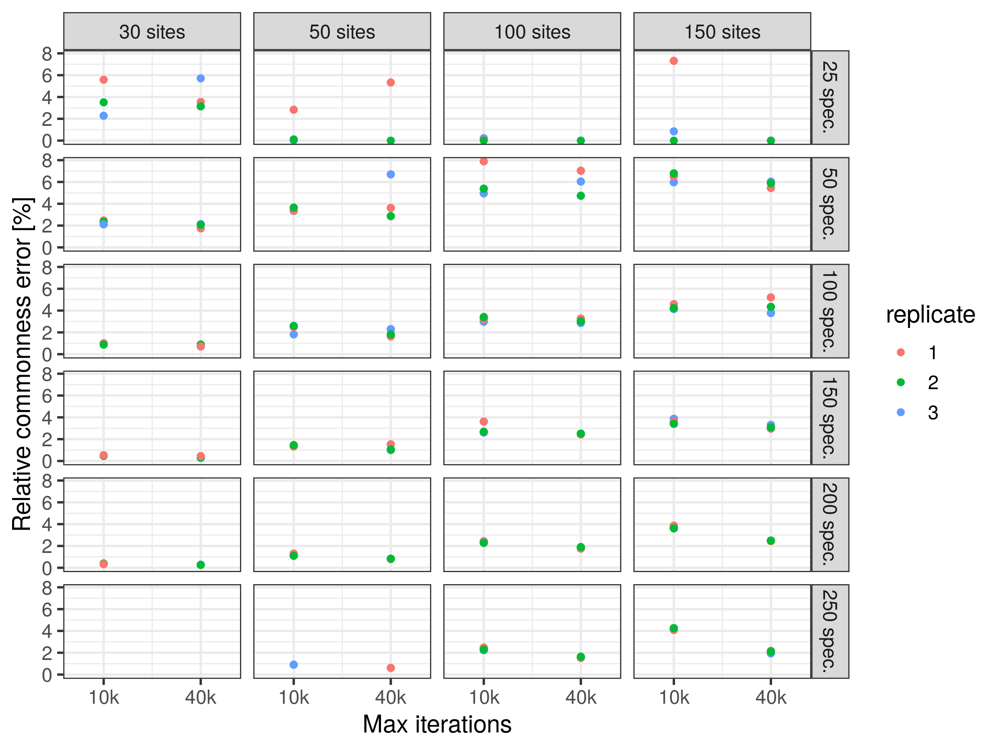

```{r setup, include=FALSE}
knitr::opts_chunk$set(echo = TRUE)
```

We will use the Barro Colorado Island (BCI) tree data set (Condit et al. 2019) to assess the performance of spectre under different parameterisations. 
Die BCI study area is divided into 1251 grid cells of 20 x 20 m, and all trees within the BCI study area are sampled regularly. 
Each grid cell is considered as one site, and a presence/absence list for all observed 328 tree species is generated, using the last recent "tree.table8".
The process generating the presence/absence list (BCI_tree8_MSP.rds) is documented in data/BCI_prepare_tree8_data.R

We sample a random subset of sites, and from that subset we sample gamma species present in the subset, if possible. 
If the number of present species in the sampled sites is smaller than gamma, we skip this parameter combination and continue with the next one.
From the subset, we calculate the target commonness matrix and the $\alpha$-diversity per site, both used as input for the spectre algorithm.
The algorithm aims to generate a solution that fulfills the two constraints given by the target commonness matrix and the $\alpha$-diversity per site. 

We will vary three parameters:

* number of sites/cells, from 30 to 150 
* gamma, the maximum number of species, from 25 to 250
* the number of iterations of the spectre algorithm (10k and 40k)

For each parameterisation we want to run 3 replicates. Code for simulations and generating the figures is found in R/BCI_parameters.R, R/BCI_run.R and R/BCI_plots.R.

### Error quantification
Firstly, we evaluate how much the commonness matrix of the predicted solution deviates from the observed target commonness matrix. The mean absolute commonness error $MAE_{commonness}$ is defined as 

$$ MAE_{commonness} = mean(abs(target - solution)) . $$ 

Secondly, we calculate the ratio between $MAE_{commonness}$ and mean of the target commonness matrix. The relative commonness error $RCE$ is defined as 
$$ RCE = \frac{MAE_{commonness}} {mean(abs(target))} * 100. $$ 


#### Results 
Most spectre-generated solutions were better after 40k iterations than after 10k. 
Given 40k iterations, spectre generated solutions for up to 150 sites and a gamma of 250 species with a $MAE_{commonness}$ < 0.8 (Fig. 1). 

```{r mae_commonness, echo=FALSE, fig.cap="\\label{fig:maecommonness} $MAE_{commonness}$ for random subsamples of the BCI data set. ", out.width = '75%'}

```

Given 40k iterations, spectre generated solutions for up to 150 sites and a gamma of 250 species with a $RCE$ < 7% (Fig. 2). 

```{r rel_commonness, echo=FALSE, fig.cap="\\label{fig:rel_commonness} $RE_{commonness}$ for random subsamples of the BCI data set. ", out.width = '75%'}

```


## Literature 
Condit, Richard et al. (2019), Complete data from the Barro Colorado 50-ha plot: 423617 trees, 35 years, v3, DataONE, Dataset, https://doi.org/10.15146/5xcp-0d46