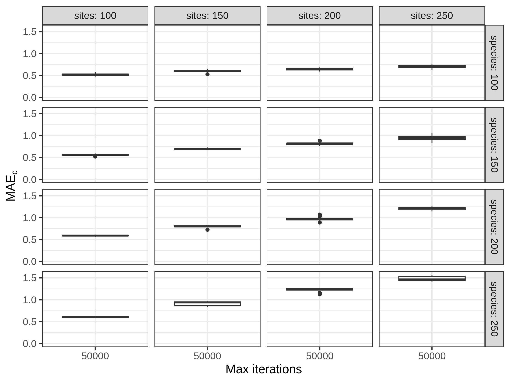
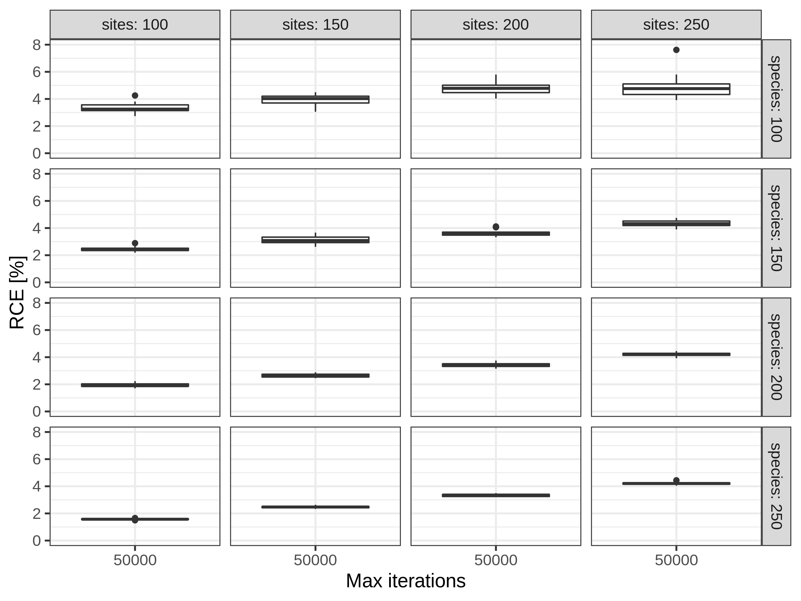

```{r setup, include=FALSE}
knitr::opts_chunk$set(echo = TRUE)
```
<!-- 
From the Barro Colorado Island tree data set (Condit et al. 2019) a presence/absence list for all observed tree species was generated.
This list provided random subsamples with 100 sites and 100 tree species, used to were used to evaluate how many tree species were correctly predicted . 
Using subsamples from these 
Sites with known community compositions can be included as lists of species presences/absences with a length equal to the total estimated number of species in the study area. 

We here show how including sites with known community compositions in the initial solution would allow 
--> 

We will use subsets of the Barro Colorado Island (BCI) tree data set (Condit et al. 2019) to additionally assess the performance of the *spectre* algorithm. In the manuscript, the algorithm is tested with artificial data, and we here show a case example using observational data for completeness. The BCI study area is divided into 1251 grid cells of 20 x 20 m, and all trees within the BCI study area are sampled regularly in time. Each grid cell is considered as one site, and a presence/absence list for all sites containing all observed 328 tree species is generated, using the last recent "tree.table8". The process generating the presence/absence list (BCI_tree8_MSP.rds) is documented in data/BCI_prepare_tree8_data.R, the presence/absence list is provided as BCI_tree8_MSP.rds (TODO MSP: change to rda and rename properly). 

To show how sensitive the *spectre*-performance is to landscape size and the number of species, we subset between 100 and 250 sites and between 100 and 250 species. For each unique combination of species and sites numbers, in intervals of 50, a number of random sites is sampled, and a number of random present species is kept. If the sampled random sites have less than the desired number of present species, this replicate of the parameter combination is skipped and we continue with the next one. From the subset, we directly derive the target commonness matrix (*calculate_solution_commonness_rcpp()*) and the $\alpha$-diversity (*colSums()*)per site, both used as input for the *run_optimization_min_conf()* function. For each parameterisation we want to run 25 replicates. Code for simulations and generating the figures is found in R/BCI_run.R and R/BCI_plots.R.

<!-- 
### Error quantification
Firstly, we evaluate how much the commonness matrix of the predicted solution deviates from the observed target commonness matrix. The mean absolute commonness error $MAE_{commonness}$ is defined as 

$$ MAE_{commonness} = mean(abs(target - solution)) . $$ 

Secondly, we calculate the ratio between $MAE_{commonness}$ and mean of the target commonness matrix. The relative commonness error $RCE$ is defined as 
$$ RCE = \frac{MAE_{commonness}} {mean(abs(target))} * 100. $$ 
--> 


#### Results 
Given 50k iterations, spectre generated solutions for up to 250 sites and a gamma of 250 species, respectively, had a $MAE_{commonness}$ < 1.5 and a RCE < 8% (Fig. 1, 2). 

```{r mae_commonness, echo=FALSE, fig.cap="\\label{fig:maecommonness} Mean absolute error in commonness $MAE_{c}$ for landscapes of different sizes with different number of species.  Commonness targets and per site richness, used as input for the spectre-algorithm, were directly derived from subsamples of the BCI tree data set.", out.width = '75%'}

```


```{r rel_commonness, echo=FALSE, fig.cap="\\label{fig:rel_commonness} $RE_{commonness}$ for random subsamples of the BCI data set. ", out.width = '75%'}

```


## Predicting specific species for specific sites
Including sites with known community compositions allows to predict specific species for specific sites. This is illustrated using subsamples of the Barro Colorado Island data set (Condit et al. 2019). We sample random presence/absence lists for 100 sites and 100 tree species from the BCI data. One fraction of the sampled data is included in the initial solution, and the remaining fraction is used to test how many species in the remaining sites are correctly predicted in the spectre-generated solution. To generate the input *fixed_species*, used in the *run_optimization_min_conf_0()* function (TODO:MSP: update to min_conf later), an empty siteXspecies matrix is created and filled with presence/absence information from known communities. The empty matrix has the same dimensions as the landscape (mot only known sites here). Notably it is also possible to have incomplete known species for a number of sites, since in case that per site richness is higher than the number of known species at that site, random species will be added later in the optimization process. In this case, only the added species will be optimized (or flipped), the "known" species will be fixed. Code for simulations and generating the figures is found in R/BCI_known_sites_run.R and R/BCI_known_sites_plots.R.

#### Results 
The number of correctly predicted species increased approximately linearly with an increasing number of sites with known species composition in the initial solutions. Including 25 sites with known community compositions roughly doubled the number of correctly predicted species from around 30% (no sites included) to > 60%. 

```{r correctly_predicted, echo=FALSE, fig.cap="\\label{fig:correctly_species} $RE_{commonness}$ for random subsamples of the BCI data set. ", out.width = '75%'}
knitr::include_graphics("../figures/BCI_known_sites_correctly_boxplot.png")
```

## Literature 
Condit, Richard et al. (2019), Complete data from the Barro Colorado 50-ha plot: 423617 trees, 35 years, v3, DataONE, Dataset, https://doi.org/10.15146/5xcp-0d46